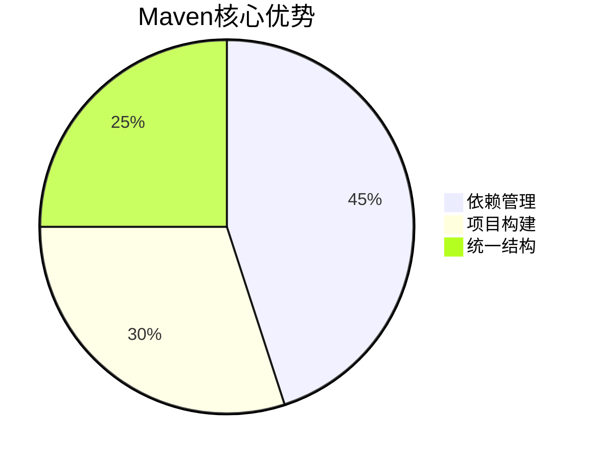
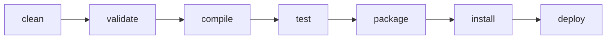
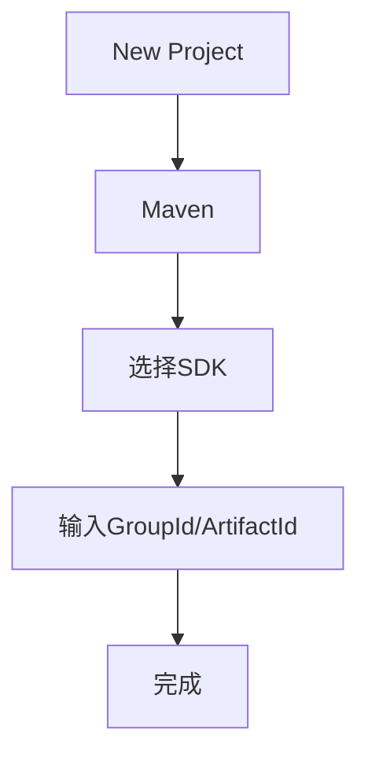
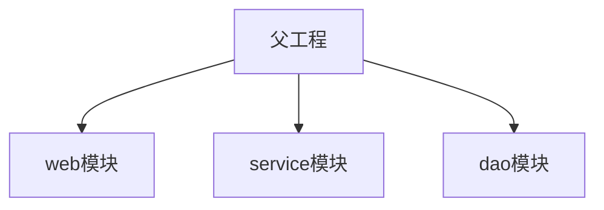
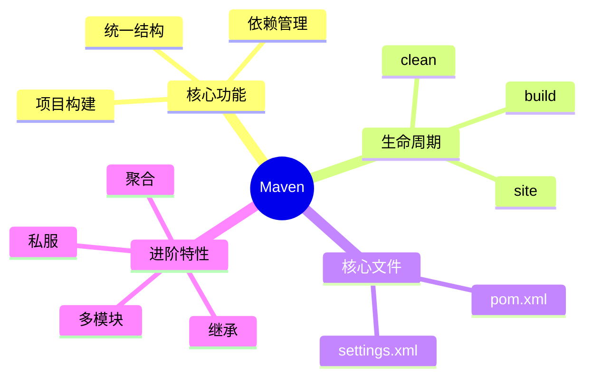
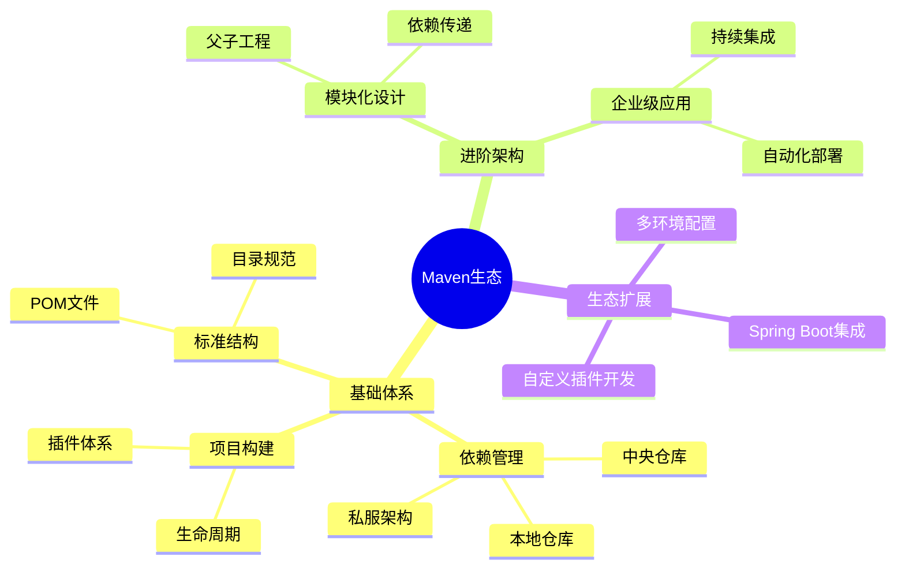

# Web后端基础


# Maven


## 🌟 一、Maven是什么？

| **属性**     | **说明**                 |
| ------------ | ------------------------ |
| **本质**     | Java项目管理和构建工具   |
| **开发方**   | Apache开源项目           |
| **核心目标** | 标准化Java项目的开发流程 |


## 🏆 二、为什么选择Maven？



### 1. 依赖管理

- **自动下载**：通过坐标自动获取jar包
- 🧩 **依赖传递**：自动处理库之间的依赖关系
- 📦 **版本控制**：集中管理依赖版本


### 2. 标准化构建



常用命令：

- `mvn clean` 🧹 清理target目录
- `mvn compile` 🖥️ 编译源代码
- `mvn test` 🧪 运行单元测试
- `mvn package` 📦 打包项目


### 3. 统一项目结构

```
my-project/
├── src/
│   ├── main/
│   │   ├── java/      # 主代码
│   │   └── resources/ # 配置文件
│   └── test/
│       ├── java/      # 测试代码
│       └── resources/
└── pom.xml            # 项目核心配置
```


## ⚙️ 三、核心概念

### 1. POM文件
```xml
<!-- 示例pom.xml -->
<project>
  <modelVersion>4.0.0</modelVersion>
  <groupId>com.mycompany</groupId>
  <artifactId>my-app</artifactId>
  <version>1.0.0</version>
  
  <dependencies>
    <dependency>
      <groupId>junit</groupId>
      <artifactId>junit</artifactId>
      <version>4.12</version>
      <scope>test</scope>
    </dependency>
  </dependencies>
</project>
```


### 2. 仓库类型

| 仓库类型 | 位置                  | 说明                     |
| -------- | --------------------- | ------------------------ |
| 本地仓库 | ~/.m2/repository      | 开发者电脑上的缓存       |
| 中央仓库 | repo.maven.apache.org | Apache官方维护的公共仓库 |
| 私服     | 公司内部搭建          | 企业内部共享的仓库       |


## 🛠️ 四、IDEA集成


### 1. 配置步骤

1. 【File】→ 【Settings】→ 搜索"Maven"
2. 设置：
   - Maven home path
   - User settings file
   - Local repository


### 2. 创建Maven项目




## 🧪 五、单元测试

```java
import org.junit.Test;
import static org.junit.Assert.*;

public class TestDemo {
    @Test
    public void testAddition() {
        assertEquals(4, 2+2);
    }
}
```
> 执行测试：`mvn test`


## 🚀 六、高级特性

### 1. 分模块设计

```
parent-project/
├── pom.xml
├── module-core
│   └── pom.xml
└── module-web
    └── pom.xml
```




### 2. 继承与聚合
```xml
<!-- 父pom.xml -->
<modules>
  <module>child-project1</module>
  <module>child-project2</module>
</modules>

<!-- 子pom.xml -->
<parent>
  <groupId>com.parent</groupId>
  <artifactId>parent-project</artifactId>
  <version>1.0</version>
</parent>
```

| 特性     | 继承           | 聚合            |
| -------- | -------------- | --------------- |
| 配置方式 | `<parent>`标签 | `<modules>`标签 |
| 作用     | 复用父POM配置  | 多模块统一构建  |


### 3. 私服搭建

推荐工具：
- Nexus Repository
- JFrog Artifactory

配置示例：
```xml
<repositories>
  <repository>
    <id>my-nexus</id>
    <url>http://nexus.example.com/repo</url>
  </repository>
</repositories>
```


## 📚 最佳实践

1. 使用阿里云镜像加速：
   ```xml
   <mirror>
     <id>aliyunmaven</id>
     <mirrorOf>*</mirrorOf>
     <url>https://maven.aliyun.com/repository/public</url>
   </mirror>
   ```
   
2. 版本管理规范：
   - SNAPSHOT：开发版本
   - RELEASE：稳定版本
   
3. 常用插件：
   - maven-compiler-plugin
   - maven-surefire-plugin
   - maven-jar-plugin


## 🧠 知识图谱





## Web基础知识


## MySQL


## JDBC


## MyBatis